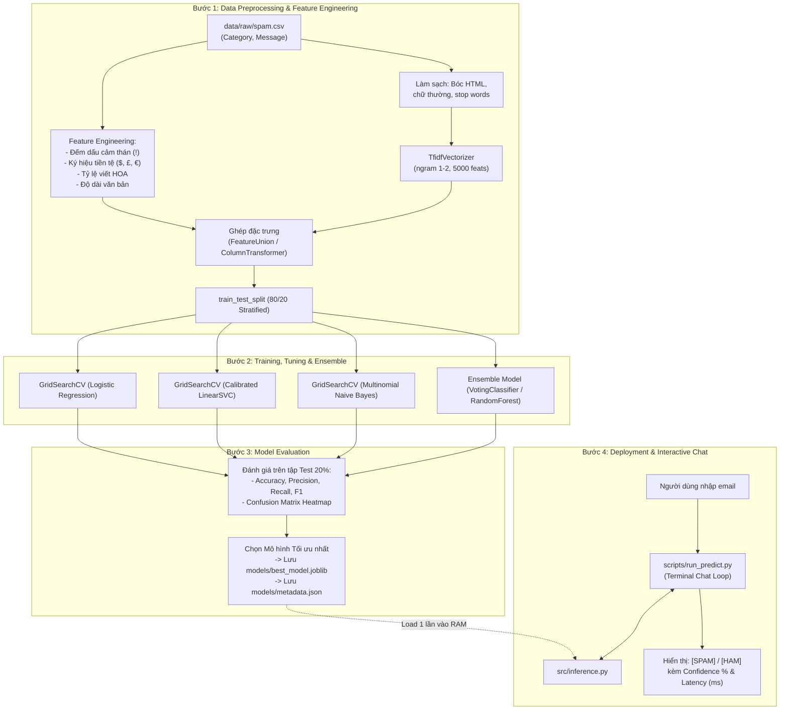

# THIẾT KẾ KIẾN TRÚC HỆ THỐNG TINH GỌN (SYSTEM DESIGN)
## PRACTICE 1: CLASSIFYING SPAM EMAILS

> **Mã tài liệu:** `DOC-DES-001`  
> **Nguyên tắc thiết kế:** Bám sát 4 bước Workflow trong đề bài kết hợp các mục mở rộng (Feature Engineering, Hyperparameter Tuning, Ensemble), cấu trúc module hóa chuẩn mực, tối ưu cho tập dữ liệu thực tế `data/raw/spam.csv`.  

---

## 1. Cấu trúc cây thư mục hoàn chỉnh (Project Tree)

```text
E:\DH_GTVT\NĂM 3\ML\baitap_code_Nhom_3\PRACTICE 1_CLASSIFYING_SPAM_EMAILS/
├── data/
│   ├── raw/
│   │   └── spam.csv                  # Dữ liệu nguồn (5.572 dòng, 2 cột Category & Message)
│   └── processed/                    # Dữ liệu sạch / trung gian (nếu cần cache)
├── docs/                             # Thư mục tài liệu thiết kế & lộ trình
│   ├── DEFINE.md                     # Đặc tả bài toán, dataset thực tế và tiêu chuẩn nghiệm thu
│   ├── DESIGN.md                     # Thiết kế kiến trúc, pipeline & giao diện ô chat
│   ├── TASKS.md                      # Kế hoạch phân rã 4 Milestones công việc
│   └── TEAM_WORKFLOW.md              # Quy chuẩn phân công & phối hợp nhóm 7 người trên GitHub
├── notebooks/                        # Jupyter Notebook phục vụ làm báo cáo & thuyết trình
│   └── eda_and_report.ipynb          # Phân tích dữ liệu (EDA), biểu đồ và so sánh mô hình
├── models/
│   ├── best_model.joblib             # Pipeline ML tối ưu hoàn chỉnh (Feature Extractor + Classifier)
│   └── metadata.json                 # Kết quả đánh giá chi tiết (Acc, Prec, Rec, F1, Confusion Matrix)
├── scripts/
│   ├── run_train.py                  # Thực thi Workflow: Preprocessing -> Train -> Tuning -> Eval
│   └── run_predict.py                # Thực thi Bước 4: Mở ô Chat Console tương tác thời gian thực
├── src/
│   ├── __init__.py
│   ├── config.py                     # Quản lý đường dẫn tương đối và siêu tham số mặc định
│   ├── preprocessing.py              # [Bước 1] Làm sạch văn bản
│   ├── features.py                   # [Bước 1] Trích xuất đặc trưng bổ trợ & TF-IDF
│   ├── models/                       # [Bước 2] Phân tách mô hình cho nhiều thành viên code song song
│   │   ├── __init__.py
│   │   ├── naive_bayes.py            # Naive Bayes + Tuning
│   │   ├── logistic_reg.py           # Logistic Regression + Tuning
│   │   ├── svm.py                    # Calibrated LinearSVC + Tuning
│   │   └── ensemble.py               # VotingClassifier & RandomForest
│   ├── evaluation.py                 # [Bước 3] Đánh giá 4 chỉ số & Confusion Matrix
│   └── inference.py                  # [Bước 4] Nạp pipeline model và dự đoán thời gian thực
├── app.py                            # Giao diện Web Demo Streamlit trực quan để báo cáo
├── tests/
│   ├── __init__.py
│   └── test_workflow.py              # Bộ kiểm thử tự động chứng minh toàn trình chạy trơn tru
├── requirements.txt                  # Danh sách thư viện (scikit-learn, pandas, numpy, joblib,...)
└── README.md                         # Hướng dẫn cài đặt và chạy nhanh hệ thống
```

---

## 2. Kiến trúc luồng xử lý toàn trình (End-to-End Workflow Pipeline)



---

## 3. Thiết kế kỹ thuật chi tiết các thành phần

### 3.1. Kỹ thuật đặc trưng kết hợp (Hybrid Feature Pipeline)
Để vừa tận dụng sức mạnh của biểu diễn từ ngữ vừa khai thác các tín hiệu spam theo đúng đề bài, Pipeline sử dụng kiến trúc ghép nối:
* **Nhánh Text (TF-IDF):** Làm sạch HTML, chuyển chữ thường, loại bỏ stop words, sinh ma trận n-gram (1, 2) cho từ khóa.
* **Nhánh Dense Features (Ký tự & Thống kê):** 
  * Số lượng dấu chấm cảm `!`.
  * Số lượng ký hiệu tiền tệ `$`, `£`, `€`.
  * Tỷ lệ ký tự in hoa / tổng số ký tự.
  * Tổng số ký tự trong thông điệp.
* Toàn bộ được đóng gói trong một `scikit-learn Pipeline` duy nhất, giúp file `best_model.joblib` có thể nhận trực tiếp văn bản thô đầu vào mà không cần bước tiền xử lý thủ công bên ngoài khi suy luận.

### 3.2. Xử lý xác suất (Probability Calibration) cho SVM
* **Vấn đề:** `LinearSVC` của Scikit-learn chỉ cung cấp `decision_function()` (khoảng cách đến siêu phẳng), không hỗ trợ phương thức `predict_proba()` mặc định.
* **Giải pháp:** Sử dụng `CalibratedClassifierCV(estimator=LinearSVC(C=...), cv=3)` hoặc dùng ánh xạ Sigmoid trên giá trị hàm quyết định. Điều này đảm bảo khi người dùng chat trong terminal, hệ thống luôn trả về chỉ số độ tin cậy phần trăm (Confidence %) chính xác và mượt mà, không gặp lỗi `AttributeError`.

### 3.3. Thiết kế Ô Chat tương tác trong `scripts/run_predict.py`
Khi người dùng chạy `python scripts/run_predict.py`, giao diện Terminal Chat hiển thị như sau:

```text
======================================================================
🤖 SPAMGUARD-ML: BỘ LỌC EMAIL SPAM TƯƠNG TÁC THỜI GIAN THỰC
======================================================================
• Mô hình tối ưu: Calibrated LinearSVC (F1-score: 98.6%)
• Hướng dẫn: Nhập nội dung email/tin nhắn cần kiểm tra rồi nhấn [Enter].
• Thoát chương trình: Gõ 'exit' hoặc 'quit'.
======================================================================

💬 Bạn: Free entry in 2 a wkly comp to win FA Cup final tickets! Text FA to 87121
🤖 AI: [ 🚨 SPAM ] | Độ tin cậy: 99.85% | Độ trễ: 1.4 ms

💬 Bạn: Hi team, please find attached the meeting notes for tomorrow.
🤖 AI: [ ✅ HAM  ] | Độ tin cậy: 99.30% | Độ trễ: 0.9 ms

💬 Bạn: WINNER!! As a valued customer you have been selected to receive $1000 prize!
🤖 AI: [ 🚨 SPAM ] | Độ tin cậy: 99.92% | Độ trễ: 1.1 ms

💬 Bạn: exit
Tạm biệt! Kết thúc phiên làm việc.
```

### 3.4. Nguyên lý an toàn và hiệu năng của Ô Chat:
1. **Nạp 1 lần (Pre-load):** Pipeline được nạp vào bộ nhớ trước khi bước vào vòng lặp `while True`.
2. **Xử lý ngoại lệ (Graceful Exit):** Bắt sự kiện `KeyboardInterrupt` (Ctrl+C) và chuỗi rỗng để không bị văng lỗi traceback ngoài ý muốn.
3. **Độ trễ phản hồi cực thấp:** Suy luận trực tiếp trên RAM đạt $< 5\text{ms}$ mỗi lần gõ.
