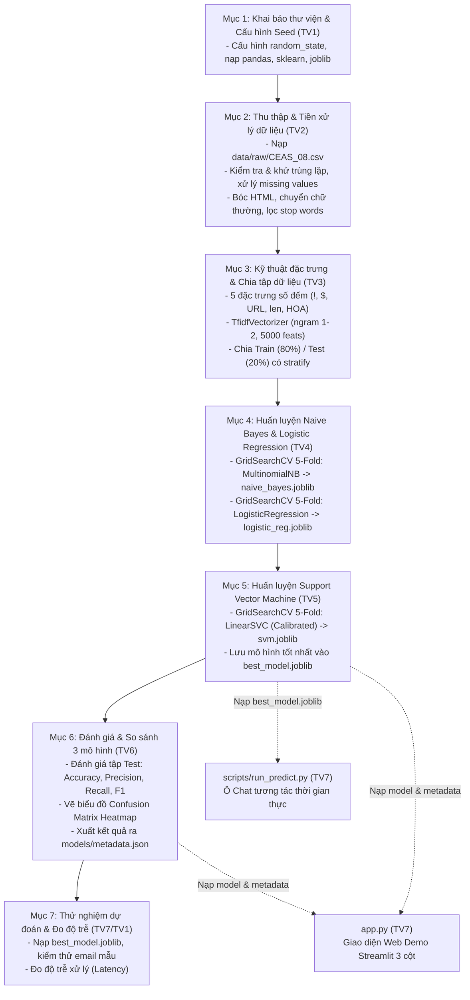

# THIẾT KẾ HỆ THỐNG & LUỒNG THỰC THI (SYSTEM DESIGN) — SPAMGUARD-ML
## PRACTICE 1: CLASSIFYING SPAM EMAILS — NHÓM 3 (UTH)
> **Giảng viên hướng dẫn:** Tiến sĩ Nguyễn Thị Khánh Tiên  
> **Nguyên tắc:** Kiến trúc tinh gọn, luồng dữ liệu toàn trình trong **1 file Jupyter Notebook duy nhất** kết hợp 2 công cụ Demo (CLI & Streamlit).

---

## 1. CÂY THƯ MỤC THỰC THI CHUẨN
```text
PRACTICE 1_CLASSIFYING_SPAM_EMAILS/
├── data/
│   ├── raw/CEAS_08.csv                       # Dữ liệu nguồn (39.154 email, 7 cột)
│   └── processed/clean_emails.csv            # Dữ liệu sạch (sau khi bóc HTML, bỏ trùng lặp)
├── docs/                                     # Bộ tài liệu đặc tả dự án
│   ├── DEFINE.md                             # 7 mục đặc tả chuẩn theo vở ghi
│   ├── DESIGN.md                             # Thiết kế kiến trúc & luồng dữ liệu (file này)
│   ├── TASKS.md                              # Phân công 7 thành viên theo các mục của Notebook
│   └── TEAM_WORKFLOW.md                      # 4 nguyên tắc Vibe Coding & Git nhánh gối đầu
├── models/                                   # Nơi lưu trữ 3 mô hình sau huấn luyện
│   ├── best_model.joblib                     # Mô hình tối ưu nhất dùng cho ô chat/web
│   ├── naive_bayes.joblib                    # Mô hình 1: Naive Bayes
│   ├── logistic_reg.joblib                   # Mô hình 2: Logistic Regression
│   ├── svm.joblib                            # Mô hình 3: Linear Support Vector Machine
│   └── metadata.json                         # Kết quả đánh giá các chỉ số & ma trận nhầm lẫn
├── notebooks/                                # KHÔNG GIAN LÀM VIỆC CHÍNH CỦA NHÓM
│   └── spam_classification.ipynb             # 1 Notebook duy nhất chứa toàn bộ 7 mục (khung sườn)
├── scripts/
│   └── run_predict.py                        # [TV7] Ô Chat dòng lệnh tương tác trực tiếp
├── app.py                                    # [TV7] Web Demo Streamlit trực quan 3 cột
├── requirements.txt                          # Danh sách thư viện cần thiết
└── README.md                                 # Hướng dẫn khởi chạy dự án
```

---

## 2. LUỒNG DỮ LIỆU TOÀN TRÌNH TRONG NOTEBOOK DUY NHẤT

Toàn bộ quy trình Machine Learning được tổ chức tuần tự từ trên xuống dưới trong file `notebooks/spam_classification.ipynb`:



---

## 3. THIẾT KẾ GIAO DIỆN NGƯỜI DÙNG (P0 & P1)

### 3.1. Ô Chat dòng lệnh (Console Chat - `scripts/run_predict.py` - P0)
```text
=== SPAMGUARD-ML TERMINAL INTERACTIVE CHAT ===
Nhập email để kiểm tra (hoặc gõ 'exit' để thoát):
💬 Nhập Subject: Urgent: Claim your prize now!
💬 Nhập Body: Click http://promo.ceas.cc to receive $1000 cash!
[ 🚨 SPAM ] | Độ tin cậy: 99.45% | Độ trễ: 21.4 ms
```

### 3.2. Web Demo Streamlit (`app.py` - P1/P2)
Giao diện 3 cột trực quan phục vụ báo cáo:
- **Cột 1 (Input):** Hộp nhập Subject và Body; nút bấm "Phân loại Email".
- **Cột 2 (Kết quả dự đoán):** Bảng hiển thị kết quả phân loại kèm thanh đo Confidence % và thời gian phản hồi (ms).
- **Cột 3 (Biểu đồ phân tích):** Ma trận nhầm lẫn (Confusion Matrix) và bảng so sánh 3 mô hình (NB, LR, SVM).
