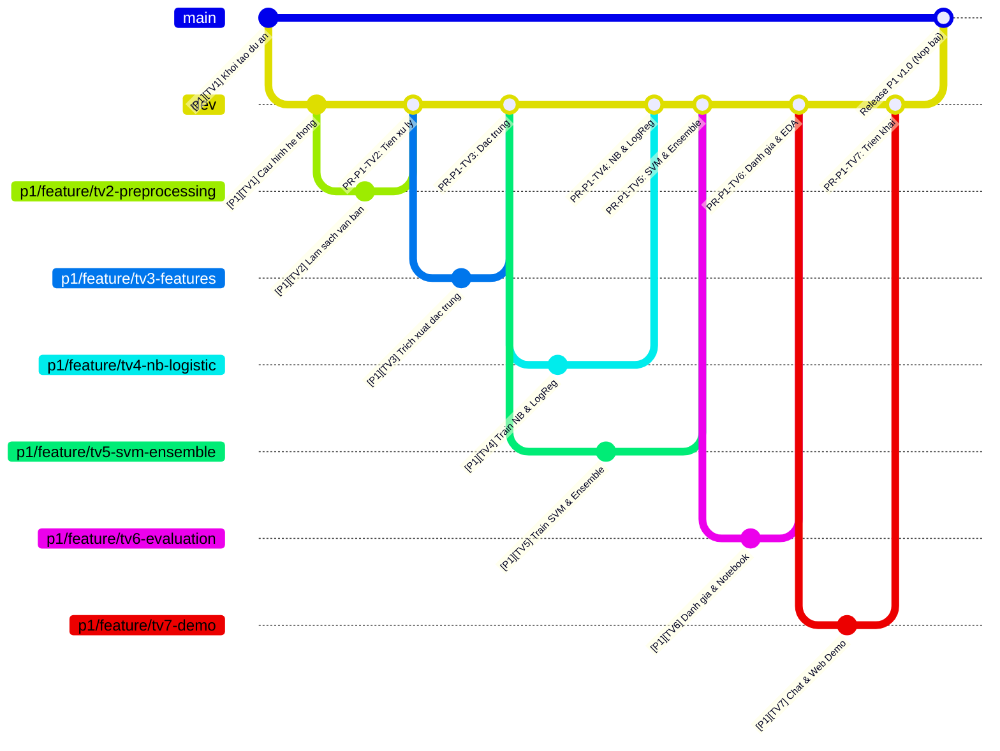

# QUY TRÌNH PHỐI HỢP DỰ ÁN TRÊN GITHUB CHO NHÓM 7 NGƯỜI (TEAM WORKFLOW SPECIFICATION)
## PRACTICE 1: CLASSIFYING SPAM EMAILS — NHÓM 3

> **Mã tài liệu:** `DOC-WKF-001`  
> **Quy mô:** Nhóm 7 thành viên  
> **Mục tiêu:** Phân định rõ ràng trách nhiệm, tối ưu hóa đóng góp cá nhân trên GitHub (Commit/PR), triệt tiêu xung đột mã nguồn (Merge Conflict), đảm bảo 100% thành viên đều có sản phẩm cụ thể để lấy điểm tối đa.

---

## 1. MA TRẬN PHÂN CÔNG 7 VAI TRÒ (ROLE & RESPONSIBILITY MATRIX)

Để tránh dẫm chân lên nhau, toàn bộ khối lượng công việc được phân rã thành 7 vị trí độc lập, mỗi người chịu trách nhiệm chính trên các module và file riêng biệt:

| STT | Thành viên & MSSV | Vị trí (Role) | Module & File phụ trách | Nhánh Git cá nhân | Nhiệm vụ kỹ thuật cụ thể |
| :---: | :--- | :--- | :--- | :--- | :--- |
| **TV 1** | **Nguyễn Xuân Đông**<br>`94206000207` | **Trưởng nhóm (Leader)**<br>Kiến trúc hệ thống | `src/config.py`<br>`requirements.txt`<br>`.gitignore`, `README.md` | `p1/feature/tv1-core-architecture` | • Khởi tạo Monorepo, thiết lập nhánh `main`, `dev`<br>• Viết module cấu hình chung (`config.py`)<br>• Quản trị PR, giải quyết conflict (nếu có)<br>• Tổng hợp Slide thuyết trình cho nhóm |
| **TV 2** | **Mai Hoàng Danh**<br>`066206005311` | **Data Cleaning Engineer** | `src/preprocessing.py` | `p1/feature/tv2-data-preprocessing` | • Bóc tách thẻ HTML bằng regex<br>• Chuẩn hóa chữ thường (lowercase)<br>• Xử lý dấu câu và loại bỏ Stop Words tiếng Anh<br>• Kiểm thử sạch dữ liệu text |
| **TV 3** | **Trương Thành Công**<br>`87206002694` | **Feature Engineer** | `src/features.py` | `p1/feature/tv3-feature-engineering` | • Trích xuất đặc trưng bổ trợ: đếm dấu `!`, `$`, độ dài chuỗi, tỷ lệ viết HOA<br>• Xây dựng và cấu hình `TfidfVectorizer`<br>• Ghép nối ma trận lai (`FeatureUnion`/`ColumnTransformer`) |
| **TV 4** | **Võ Khôi Nguyên**<br>`79206001370` | **ML Engineer 1**<br>(NB & Logistic Regression) | `src/models/naive_bayes.py`<br>`src/models/logistic_reg.py` | `p1/feature/tv4-nb-logistic` | • Xây dựng pipeline `MultinomialNB`<br>• Xây dựng pipeline `LogisticRegression`<br>• Áp dụng `GridSearchCV` 5-fold CV tìm tham số $\alpha$ và $C$ tối ưu |
| **TV 5** | **Võ Thanh Phú**<br>`89206003078` | **ML Engineer 2**<br>(SVM & Ensemble Methods) | `src/models/svm.py`<br>`src/models/ensemble.py` | `p1/feature/tv5-svm-ensemble` | • Xây dựng mô hình `CalibratedClassifierCV(LinearSVC)` hỗ trợ tính xác suất<br>• Xây dựng mô hình kết hợp `VotingClassifier` & `RandomForestClassifier`<br>• Tuning tham số $C$ của SVM |
| **TV 6** | **Nguyễn Minh Nhật**<br>`70206006644` | **Evaluation & EDA Analyst** | `src/evaluation.py`<br>`notebooks/eda_and_report.ipynb` | `p1/feature/tv6-model-evaluation` | • Tính toán 4 chỉ số (Accuracy, Precision, Recall, F1)<br>• Vẽ biểu đồ nhiệt Ma trận nhầm lẫn (Confusion Matrix Heatmap)<br>• Xây dựng file Jupyter Notebook báo cáo trực quan cho giảng viên |
| **TV 7** | **Mai An Thịnh**<br>`052206005348` | **Deployment & Demo Engineer** | `scripts/run_predict.py`<br>`app.py` (Streamlit UI)<br>`tests/test_workflow.py` | `p1/feature/tv7-deployment-demo` | • Xây dựng Console Chat tương tác thời gian thực<br>• Xây dựng Web Demo giao diện Streamlit (cho buổi báo cáo)<br>• Viết bộ Unit Test kiểm tra toàn trình |

---

## 2. CẤU TRÚC MÃ NGUỒN MODULE HÓA CHO NHÓM (MODULAR ARCHITECTURE)

Cấu trúc thư mục được chia nhỏ để các thành viên có thể code độc lập mà không bao giờ chỉnh sửa cùng một file:

```text
PRACTICE 1_CLASSIFYING_SPAM_EMAILS/
├── data/
│   ├── raw/
│   │   └── spam.csv                  # Dữ liệu nguồn (5.572 dòng)
│   └── processed/                    # Dữ liệu cache trung gian (nếu cần)
├── docs/
│   ├── DEFINE.md                     # [Chung] Đặc tả bài toán
│   ├── DESIGN.md                     # [Chung] Thiết kế hệ thống
│   ├── TASKS.md                      # [Chung] Phân rã 4 Milestones
│   └── TEAM_WORKFLOW.md              # [Tài liệu này] Quy chuẩn làm việc nhóm 7 người
├── notebooks/
│   └── eda_and_report.ipynb          # [TV 6 độc quyền] Notebook phân tích & vẽ biểu đồ báo cáo
├── models/
│   ├── best_model.joblib             # Pipeline ML hoàn chỉnh tối ưu nhất
│   └── metadata.json                 # Kết quả đánh giá chi tiết
├── scripts/
│   ├── run_train.py                  # [TV 1] Script gọi chạy toàn bộ quá trình train & eval
│   └── run_predict.py                # [TV 7] Script mở ô Chat Console tương tác
├── src/
│   ├── __init__.py
│   ├── config.py                     # [TV 1] Đường dẫn & siêu tham số chung
│   ├── preprocessing.py              # [TV 2] Làm sạch văn bản thô
│   ├── features.py                   # [TV 3] Trích xuất đặc trưng & TF-IDF
│   ├── models/                       # [Chia tách mô hình để TV 4 & TV 5 làm việc song song]
│   │   ├── __init__.py
│   │   ├── naive_bayes.py            # [TV 4]
│   │   ├── logistic_reg.py           # [TV 4]
│   │   ├── svm.py                    # [TV 5]
│   │   └── ensemble.py               # [TV 5]
│   ├── evaluation.py                 # [TV 6] Đánh giá 4 chỉ số & Confusion Matrix
│   └── inference.py                  # [TV 7] Engine nạp model và dự đoán đầu vào
├── tests/
│   ├── __init__.py
│   └── test_workflow.py              # [TV 7] Bộ kiểm thử tự động toàn diện
├── app.py                            # [TV 7] Giao diện Web App Streamlit trực quan để demo
├── requirements.txt                  # [TV 1 quản lý]
└── README.md                         # [TV 1 & Nhóm] Hướng dẫn chạy dự án
```

---

## 3. CHIẾN LƯỢC PHÂN NHÁNH TRÊN GITHUB (GIT FLOW)



### Quy tắc phân nhánh trong Monorepo:
1. **Nhánh `main`:** Được cài đặt chế độ Protected (Bảo vệ). Tuyệt đối không commit trực tiếp vào `main`. Nhánh này chỉ merge từ `dev` khi bài tập đã sẵn sàng nộp.
2. **Nhánh `dev`:** Nhánh tích hợp trung tâm của cả nhóm cho toàn bộ các bài trong kỳ.
3. **Nhánh tính năng cá nhân (`p<số>/feature/...`):** Mỗi thành viên tạo nhánh riêng từ `dev` gắn với mã bài tập:
   * **Khi làm Practice 1:** `p1/feature/tv<số>-<tên-chức-năng>`
   * **Khi làm Practice 2:** `p2/feature/tv<số>-<tên-chức-năng>`

---

## 4. HƯỚNG DẪN CÁC BƯỚC THAO TÁC GIT HÀNG NGÀY CHO THÀNH VIÊN

### Bước 1: Lấy code mới nhất trước khi làm việc
Mỗi khi bắt đầu ngồi vào máy, luôn kéo code mới nhất từ nhánh `dev`:
```bash
git checkout dev
git pull origin dev
```

### Bước 2: Tạo hoặc chuyển sang nhánh cá nhân của mình
```bash
git checkout -b p1/feature/tv2-data-preprocessing
# (hoặc nếu nhánh đã có: git checkout p1/feature/tv2-data-preprocessing)
```

### Bước 3: Lập trình và Quy tắc Commit dễ hiểu cho Nhóm (Commit Convention)

Mỗi thành viên chia nhỏ công việc thành nhiều lần commit (tối thiểu 3-5 commits).

👉 **Cú pháp commit chuẩn trong Monorepo:**
```text
[P<mã-bài>][TV<số>] <Loại hành động>: <Mô tả việc đã làm bằng tiếng Việt ngắn gọn>
```

**Bảng các loại hành động thông dụng:**
* `Khoi tao`: Bắt đầu tạo file mới, cấu trúc mới.
* `Them`: Viết hàm mới, thuật toán mới, giao diện mới.
* `Sua`: Sửa lỗi logic, sửa lỗi hiển thị, tối ưu code.
* `Danh gia`: Chạy test, đo chỉ số điểm, vẽ ma trận.
* `Tai lieu`: Viết comment, cập nhật tài liệu báo cáo.

**Ví dụ thực tế khi làm Practice 1:**
* **TV 1:** `git commit -m "[P1][TV1] Khoi tao: Tao cau truc thu muc va bo tai lieu huong dan"`
* **TV 2:** `git commit -m "[P1][TV2] Them: Ham boc tach HTML va loc dau cau"`
* **TV 3:** `git commit -m "[P1][TV3] Them: Trich xuat dac trung dau cham cam va ky hieu tien te"`
* **TV 4:** `git commit -m "[P1][TV4] Them: Huan luyen va tuning Naive Bayes va Logistic Regression"`
* **TV 5:** `git commit -m "[P1][TV5] Them: Huan luyen Calibrated LinearSVC va Voting Classifier"`
* **TV 6:** `git commit -m "[P1][TV6] Danh gia: Tinh 4 chi so F1 va xuat bieu do Confusion Matrix"`
* **TV 7:** `git commit -m "[P1][TV7] Them: Giao dien chat terminal va web app Streamlit"`
* Khi sửa lỗi: `git commit -m "[P1][TV2] Sua: Xu ly ngoai le khi chuoi email bi rong"`

> 💡 **Lợi ích:** Khi thầy cô hoặc nhóm mở lịch sử Git (`git log` hoặc mục Commits trên GitHub), sẽ thấy ngay từng người (TV1 $\rightarrow$ TV7) đã làm phần việc nào cho bài nào (P1, P2,...), minh bạch 100% công sức của từng bạn!

### Bước 4: Đẩy nhánh lên GitHub và tạo Pull Request (PR)
```bash
git push -u origin p1/feature/tv2-data-preprocessing
```
* Truy cập GitHub Repository $\rightarrow$ Chọn **Compare & pull request**.
* **Base branch:** chọn `dev` | **Compare branch:** chọn nhánh của mình.
* Viết tóm tắt các việc đã hoàn thành trong mô tả PR.
* Gán **Reviewers:** Chọn Leader (TV 1) hoặc thành viên phụ trách module liên quan.

### Bước 5: Review và Merge
* Người Review kiểm tra code không bị lỗi cú pháp $\rightarrow$ Nhấn **Approve**.
* Leader nhấn **Merge Pull Request** vào nhánh `dev`.

---

## 5. 3 QUY TẮC "SỐNG CÒN" ĐỂ TRÁNH CONFLICT & BẢO VỆ ĐIỂM SỐ

###  Quy tắc 1: Quản lý file Jupyter Notebook (`.ipynb`)
File notebook lưu trữ dạng JSON có chứa siêu dữ liệu (metadata, cell outputs). Nếu 2 người cùng sửa một file notebook sẽ gây xung đột không thể cứu vãn.
* **Quy ước:** Chỉ **TV 6** được quyền chỉnh sửa và commit file `notebooks/eda_and_report.ipynb`.
* Các thành viên khác nếu cần chạy thử nghiệm notebook thì tự tạo file nháp cá nhân (ví dụ: `scratch_tv4.ipynb`) và thêm file này vào `.gitignore` để không push lên repo chung.

###  Quy tắc 2: Không sửa file của thành viên khác khi chưa thỏa thuận
* Nếu TV 4 cần hàm làm sạch của TV 2, hãy đợi TV 2 merge xong vào nhánh `dev`, sau đó TV 4 kéo nhánh `dev` về và chỉ việc `from src.preprocessing import clean_text`. Tuyệt đối không tự ý mở `src/preprocessing.py` để sửa đổi.

###  Quy tắc 3: Cập nhật thư viện chung qua `requirements.txt`
* Khi một bạn cài thêm thư viện mới (ví dụ: `streamlit`, `seaborn`), thông báo cho **TV 1** để TV 1 cập nhật chính thức vào `requirements.txt` trên nhánh `dev`, tránh việc mỗi người dùng một phiên bản thư viện gây lỗi mismatch môi trường.

---

## 6. TIÊU CHÍ ĐÁNH GIÁ ĐÓNG GÓP (PHỤC VỤ CHẤM ĐIỂM QUÁ TRÌNH)

Khi giảng viên kiểm tra trang **Insights $\rightarrow$ Contributors** của GitHub Repo:
1. **100% (7/7) thành viên** đều có tên trong danh sách Contributors.
2. Mỗi thành viên có tối thiểu từ **5 commits có ý nghĩa** trở lên được merge qua Pull Request.
3. Mỗi thành viên phụ trách ít nhất 1 bài trình bày trong buổi báo cáo tương ứng với module mình đã viết code.
