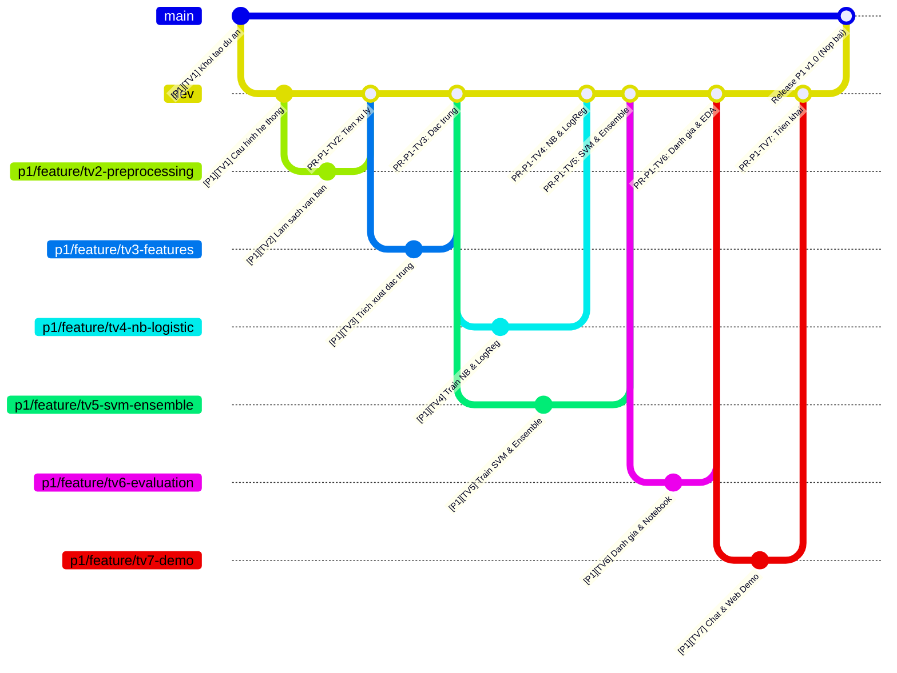

# QUY TRÌNH PHỐI HỢP DỰ ÁN TRÊN GITHUB CHO NHÓM 7 NGƯỜI (TEAM WORKFLOW SPECIFICATION)
## PRACTICE 1: CLASSIFYING SPAM EMAILS — NHÓM 3

> **Bộ môn:** Học máy (Machine Learning) — Trường ĐH Giao thông Vận tải TP.HCM (UTH)  
> **Giảng viên hướng dẫn (GVHD):** Tiến sĩ Nguyễn Thị Khánh Tiên  
> **Thực hiện:** Nhóm 3 (7 thành viên)  
> **Mục tiêu:** Phân định rõ ràng trách nhiệm, tối ưu hóa đóng góp cá nhân trên GitHub (Commit/PR), triệt tiêu xung đột mã nguồn (Merge Conflict), đảm bảo 100% thành viên đều có sản phẩm cụ thể để lấy điểm tối đa.

---

## 1. MA TRẬN PHÂN CÔNG & ĐÁNH GIÁ ĐÓNG GÓP 7 THÀNH VIÊN (ROLE & CONTRIBUTION MATRIX)

Để tránh dẫm chân lên nhau, toàn bộ khối lượng công việc được phân rã thành 7 vị trí độc lập, mỗi người chịu trách nhiệm chính trên các module và file riêng biệt:

| STT | Thành viên & MSSV | Vị trí (Role) | Module & File phụ trách | Nhánh Git cá nhân | Mức độ đóng góp | Nhiệm vụ kỹ thuật cụ thể |
| :---: | :--- | :--- | :--- | :--- | :---: | :--- |
| **TV 1** | **Nguyễn Xuân Đông**<br>`94206000207` | **Trưởng nhóm (Leader)**<br>Kiến trúc hệ thống | `src/config.py`<br>`requirements.txt`<br>`.gitignore`, `README.md` | `p1/feature/tv1-core-architecture` | **100% (A)** | • Khởi tạo Monorepo, thiết lập nhánh `main`, `dev`<br>• Viết module cấu hình chung (`config.py`)<br>• Quản trị PR, giải quyết conflict (nếu có)<br>• Tổng hợp Slide thuyết trình cho nhóm |
| **TV 2** | **Mai Hoàng Danh**<br>`066206005311` | **Data Cleaning Engineer** | `src/preprocessing.py` | `p1/feature/tv2-data-preprocessing` | **100% (A)** | • Bóc tách thẻ HTML bằng regex<br>• Chuẩn hóa chữ thường (lowercase)<br>• Xử lý dấu câu và loại bỏ Stop Words tiếng Anh<br>• Kiểm thử sạch dữ liệu text |
| **TV 3** | **Trương Thành Công**<br>`87206002694` | **Feature Engineer** | `src/features.py` | `p1/feature/tv3-feature-engineering` | **100% (A)** | • Trích xuất đặc trưng bổ trợ: đếm dấu `!`, `$`, độ dài chuỗi, tỷ lệ viết HOA<br>• Xây dựng và cấu hình `TfidfVectorizer`<br>• Ghép nối ma trận lai (`FeatureUnion`/`ColumnTransformer`) |
| **TV 4** | **Võ Khôi Nguyên**<br>`79206001370` | **ML Engineer 1**<br>(NB & Logistic Regression) | `src/models/naive_bayes.py`<br>`src/models/logistic_reg.py` | `p1/feature/tv4-nb-logistic` | **100% (A)** | • Xây dựng pipeline `MultinomialNB`<br>• Xây dựng pipeline `LogisticRegression`<br>• Áp dụng `GridSearchCV` 5-fold CV tìm tham số $\alpha$ và $C$ tối ưu |
| **TV 5** | **Võ Thanh Phú**<br>`89206003078` | **ML Engineer 2**<br>(SVM & Ensemble Methods) | `src/models/svm.py`<br>`src/models/ensemble.py` | `p1/feature/tv5-svm-ensemble` | **100% (A)** | • Xây dựng mô hình `CalibratedClassifierCV(LinearSVC)` hỗ trợ tính xác suất<br>• Xây dựng mô hình kết hợp `VotingClassifier` & `RandomForestClassifier`<br>• Tuning tham số $C$ của SVM |
| **TV 6** | **Nguyễn Minh Nhật**<br>`70206006644` | **Evaluation & EDA Analyst** | `src/evaluation.py`<br>`notebooks/eda_and_report.ipynb` | `p1/feature/tv6-model-evaluation` | **100% (A)** | • Tính toán 4 chỉ số (Accuracy, Precision, Recall, F1)<br>• Vẽ biểu đồ nhiệt Ma trận nhầm lẫn (Confusion Matrix Heatmap)<br>• Xây dựng file Jupyter Notebook báo cáo trực quan cho giảng viên |
| **TV 7** | **Mai An Thịnh**<br>`052206005348` | **Deployment & Demo Engineer** | `scripts/run_predict.py`<br>`app.py` (Streamlit UI)<br>`tests/test_workflow.py` | `p1/feature/tv7-deployment-demo` | **100% (A)** | • Xây dựng Console Chat tương tác thời gian thực<br>• Xây dựng Web Demo giao diện Streamlit (cho buổi báo cáo)<br>• Viết bộ Unit Test kiểm tra toàn trình |

---

## 2. CẤU TRÚC MÃ NGUỒN MODULE HÓA CHO NHÓM (MODULAR ARCHITECTURE)

Cấu trúc thư mục được chia nhỏ để các thành viên có thể code độc lập mà không bao giờ chỉnh sửa cùng một file:

```text
PRACTICE 1_CLASSIFYING_SPAM_EMAILS/
├── data/
│   ├── raw/
│   │   └── spam.csv                  # Dữ liệu nguồn (5.572 dòng)
│   └── processed/                    # Dữ liệu cache trung gian (nếu cần)
├── docs/
│   ├── DEFINE.md                     # [Chung] Đặc tả bài toán
│   ├── DESIGN.md                     # [Chung] Thiết kế hệ thống
│   ├── TASKS.md                      # [Chung] Phân rã 4 Milestones
│   └── TEAM_WORKFLOW.md              # [Tài liệu này] Quy chuẩn làm việc nhóm 7 người
├── notebooks/
│   └── eda_and_report.ipynb          # [TV 6 độc quyền] Notebook phân tích & vẽ biểu đồ báo cáo
├── models/
│   ├── best_model.joblib             # Pipeline ML hoàn chỉnh tối ưu nhất
│   └── metadata.json                 # Kết quả đánh giá chi tiết
├── scripts/
│   ├── run_train.py                  # [TV 1] Script gọi chạy toàn bộ quá trình train & eval
│   └── run_predict.py                # [TV 7] Script mở ô Chat Console tương tác
├── src/
│   ├── __init__.py
│   ├── config.py                     # [TV 1] Đường dẫn & siêu tham số chung
│   ├── preprocessing.py              # [TV 2] Làm sạch văn bản thô
│   ├── features.py                   # [TV 3] Trích xuất đặc trưng & TF-IDF
│   ├── models/                       # [Chia tách mô hình để TV 4 & TV 5 làm việc song song]
│   │   ├── __init__.py
│   │   ├── naive_bayes.py            # [TV 4]
│   │   ├── logistic_reg.py           # [TV 4]
│   │   ├── svm.py                    # [TV 5]
│   │   └── ensemble.py               # [TV 5]
│   ├── evaluation.py                 # [TV 6] Đánh giá 4 chỉ số & Confusion Matrix
│   └── inference.py                  # [TV 7] Engine nạp model và dự đoán đầu vào
├── tests/
│   ├── __init__.py
│   └── test_workflow.py              # [TV 7] Bộ kiểm thử tự động toàn diện
├── app.py                            # [TV 7] Giao diện Web App Streamlit trực quan để demo
├── requirements.txt                  # [TV 1 quản lý]
└── README.md                         # [TV 1 & Nhóm] Hướng dẫn chạy dự án
```

---

## 3. CHIẾN LƯỢC PHÂN NHÁNH TRÊN GITHUB (GIT FLOW)



### Quy tắc phân nhánh trong Monorepo:
1. **Nhánh `main`:** Được cài đặt chế độ Protected (Bảo vệ). Tuyệt đối không commit trực tiếp vào `main`. Nhánh này chỉ merge từ `dev` khi bài tập đã sẵn sàng nộp.
2. **Nhánh `dev`:** Nhánh tích hợp trung tâm của cả nhóm cho toàn bộ các bài trong kỳ.
3. **Nhánh tính năng cá nhân (`p<số>/feature/...`):** Mỗi thành viên tạo nhánh riêng từ `dev` gắn với mã bài tập:
   * **Khi làm Practice 1:** `p1/feature/tv<số>-<tên-chức-năng>`
   * **Khi làm Practice 2:** `p2/feature/tv<số>-<tên-chức-năng>`

---

## 4. HƯỚNG DẪN THAO TÁC GIT CỰC KỲ DỄ HIỂU CHO TỪNG THÀNH VIÊN (CẦM TAY CHỈ VIỆC)

### 📌 Bước 1: Luôn lấy code mới nhất trước khi bắt đầu làm
Mỗi khi mở máy tính lên để làm bài, hãy đồng bộ code mới nhất của cả nhóm về máy mình:
```bash
# 1. Chuyển về nhánh dev
git checkout dev

# 2. Kéo code mới nhất từ GitHub về
git pull origin dev
```

---

### 📌 Bước 2: Tạo hoặc chuyển vào nhánh cá nhân của mình

#### Trường hợp A: Nếu đây là **LẦN ĐẦU TIÊN** bạn tạo nhánh làm bài:
Dùng lệnh `checkout -b` (chữ `-b` nghĩa là tạo nhánh mới rồi nhảy sang nhánh đó luôn):
```bash
# Ví dụ TV 2 tạo nhánh làm sạch dữ liệu:
git checkout -b p1/feature/tv2-data-preprocessing

# Ví dụ TV 3 tạo nhánh đặc trưng:
git checkout -b p1/feature/tv3-feature-engineering
```

#### Trường hợp B: Nếu bạn **ĐÃ TẠO NHÁNH TỪ HÔM TRƯỚC RỒI**, hôm nay code tiếp:
Dùng lệnh `checkout` bình thường (KHÔNG có chữ `-b`):
```bash
git checkout p1/feature/tv2-data-preprocessing
```

> ❓ **Làm sao biết mình đang đứng ở nhánh nào?**  
> Gõ lệnh: `git branch`  
> Nhánh nào có dấu sao `*` màu xanh lá cây ở đầu chính là nhánh bạn đang đứng!

---

### 📌 Bước 3: Lập trình và Commit lưu lại kết quả

Sau khi bạn code xong 1 hàm hoặc sửa xong 1 file:
```bash
# 1. Kiểm tra xem mình đã chỉnh sửa file nào (file sẽ hiện màu đỏ)
git status

# 2. Thêm file đó vào danh sách chuẩn bị lưu (Staging area)
git add src/preprocessing.py
# (hoặc nếu sửa nhiều file: git add .)

# 3. Lưu lại với lời nhắn rõ ràng (theo cú pháp nhóm đã quy định):
git commit -m "[P1][TV2] Them: Ham boc tach the HTML va loc dau cau"
```

*Quy tắc commit dễ hiểu:* `[P1][TV<số>] <Loại>: <Mô tả việc đã làm>`  
*(Mỗi thành viên nên chia nhỏ việc để commit từ 3 - 5 lần, không nên dồn tất cả vào 1 commit duy nhất).*

---

### 📌 Bước 4: Đẩy code lên GitHub và Mở Pull Request (PR)

Khi bạn đã hoàn thành xong nhiệm vụ của mình và muốn nộp vào dự án chung:

#### 1. Chạy lệnh đẩy nhánh lên GitHub:
```bash
# Thay tên nhánh bằng đúng tên nhánh của bạn:
git push -u origin p1/feature/tv2-data-preprocessing
```

#### 2. Thao tác trên giao diện Web GitHub (Rất đơn giản):
1. Mở trình duyệt vào link Repository GitHub của nhóm.
2. Bạn sẽ thấy ngay một dải thông báo màu vàng hiện lên ở đầu trang:  
   `p1/feature/tv2-data-preprocessing had recent pushes ...` $\rightarrow$ Bấm vào nút màu xanh **Compare & pull request**.
3. **Tại trang mở Pull Request:**
   * **Base branch (Nhánh đích):** Chọn **`dev`** *(Cực kỳ quan trọng: Luôn merge vào `dev`, KHÔNG chọn `main`)*.
   * **Compare branch (Nhánh nguồn):** Chọn đúng nhánh của bạn (`p1/feature/...`).
   * **Title (Tiêu đề PR):** Ghi rõ ràng, ví dụ: `[P1][TV2] Hoàn thành module làm sạch dữ liệu text`.
   * **Description (Mô tả):** Liệt kê ngắn gọn 2-3 gạch đầu dòng những hàm bạn đã viết và đã test thử.
   * **Reviewers (Góc bên phải màn hình):** Bấm vào bánh răng cưa và chọn **Leader (Nguyễn Xuân Đông)** để chấm/duyệt bài.
4. Bấm nút màu xanh **Create pull request** $\rightarrow$ **Xong!** Bạn đã nộp bài thành công.

---

### 📌 Bước 5: Leader Review và Merge code vào nhánh chung (Dành cho TV 1)

1. Trưởng nhóm mở tab **Pull requests** trên GitHub $\rightarrow$ Bấm vào PR vừa được gửi.
2. Bấm vào tab **Files changed** để xem code của thành viên (dòng màu xanh lá là viết mới, dòng màu đỏ là xóa).
3. Kiểm tra code thấy đúng chuẩn, không gây lỗi cú pháp $\rightarrow$ Bấm nút **Review changes** ở góc phải $\rightarrow$ Chọn **Approve** $\rightarrow$ Bấm **Submit review**.
4. Quay lại tab chính của PR, bấm nút màu xanh **Merge pull request** $\rightarrow$ Bấm tiếp **Confirm merge**.
5. Nhánh của thành viên đó đã được hòa nhập an toàn 100% vào nhánh `dev` của cả nhóm!

---

## 5. CƠ CHẾ LẬP TRÌNH SONG SONG (KHÔNG CẦN CHỜ NHAU)

### ❓ Nguyên lý phối hợp song song:
Cả 7 thành viên có thể cùng mở máy lên lập trình độc lập trong cùng 1 ngày mà không cần chờ đợi nhau nhờ phương pháp **"Hợp đồng giao diện (Contract / Interface)"**:
* Dữ liệu gốc `data/raw/spam.csv` cả 7 thành viên đều có sẵn.
* Mỗi module được chuẩn hóa rõ ràng đầu vào (Input) và đầu ra (Output):
  * **TV 2 (`preprocessing.py`):** Nhận chuỗi text thô $\rightarrow$ Trả về chuỗi text sạch (đã bóc HTML, chữ thường, lọc dấu câu, stop words).
  * **TV 3 (`features.py`):** Nhận chuỗi text $\rightarrow$ Trả về ma trận TF-IDF ghép nối cùng các đặc trưng số (đếm `!`, `$`, tỷ lệ viết HOA, độ dài).
  * **TV 4 & TV 5 (`models/`):** Xây dựng Pipeline và GridSearchCV, lưu ra 3 file mô hình độc lập (`models/naive_bayes.joblib`, `models/logistic_reg.joblib`, `models/svm.joblib`).
  * **TV 6 (`evaluation.py`):** Nhận `(y_true, y_pred)` $\rightarrow$ Tính 4 chỉ số (Acc, Prec, Rec, F1) và vẽ ma trận Confusion Matrix.
  * **TV 7 (`app.py` & `scripts/`):** Nạp 3 mô hình từ thư mục `models/` để hiển thị so sánh song song trên Web Demo Streamlit và Console Chat. Trong quá trình phát triển, TV 7 sử dụng hàm giả lập (Mock) để hoàn thiện giao diện trước mà không cần đợi mô hình train xong.

---

## 6. 3 QUY TẮC "SỐNG CÒN" ĐỂ TRÁNH CONFLICT & BẢO VỆ ĐIỂM SỐ

### 🔒 Quy tắc 1: Quản lý file Jupyter Notebook (`.ipynb`)
File notebook lưu trữ dạng JSON có chứa siêu dữ liệu (metadata, cell outputs). Nếu 2 người cùng sửa một file notebook sẽ gây xung đột không thể cứu vãn.
* **Quy ước:** Chỉ **TV 6 (Nguyễn Minh Nhật)** được quyền chỉnh sửa và commit file `notebooks/eda_and_report.ipynb`.
* Các thành viên khác nếu cần chạy thử nghiệm notebook thì tự tạo file nháp cá nhân (ví dụ: `scratch_tv4.ipynb`) và thêm file này vào `.gitignore` để không push lên repo chung.

### 🔒 Quy tắc 2: Không sửa file của thành viên khác khi chưa thỏa thuận
* Mỗi bạn chỉ làm việc trong file được phân công. Khi cần dùng hàm của bạn khác, chỉ việc `from src... import ...`. Tuyệt đối không tự ý mở file của bạn khác ra sửa.

### 🔒 Quy tắc 3: Cập nhật thư viện chung qua `requirements.txt`
* Khi một bạn cài thêm thư viện mới (ví dụ: `streamlit`, `seaborn`), thông báo cho **Leader** để Leader cập nhật chính thức vào `requirements.txt` trên nhánh `dev`.

---

## 7. TIÊU CHÍ ĐÁNH GIÁ ĐÓNG GÓP (PHỤC VỤ CHẤM ĐIỂM QUÁ TRÌNH)

Khi giảng viên kiểm tra trang **Insights $\rightarrow$ Contributors** của GitHub Repo:
1. **100% (7/7) thành viên** đều có tên trong danh sách Contributors.
2. Mỗi thành viên có tối thiểu từ **3 - 5 commits có ý nghĩa** trở lên được merge qua Pull Request.
3. Mỗi thành viên nắm rõ phần code của mình để tự tin trả lời khi Thầy/Cô vấn đáp.
